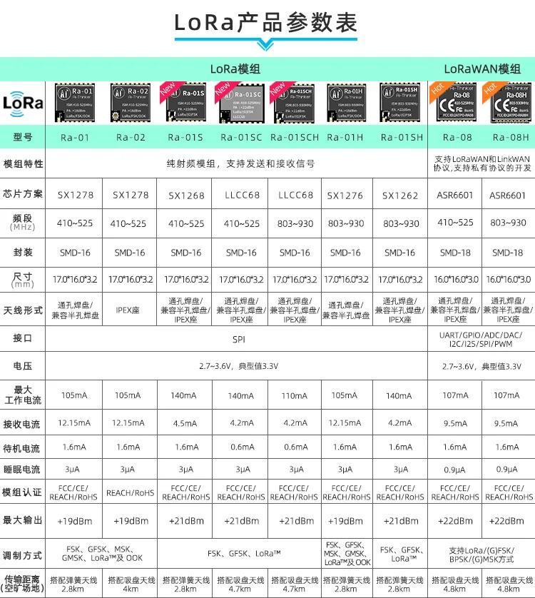
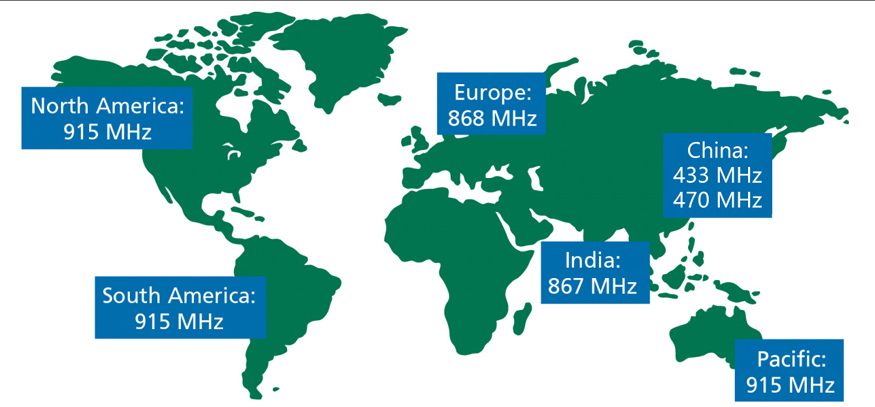

# LoRa

## Introduction to LoRa Chips

LoRa (Long Range) is a wireless communication technology that enables long-range, low-power communication between devices. LoRa chips, also known as LoRaWAN chips, are the key components in LoRa-based devices.

LoRa chips utilize a spread spectrum modulation technique to achieve long-range communication while consuming minimal power. They operate in the unlicensed Industrial, Scientific, and Medical (ISM) bands, making them suitable for a wide range of applications.

With their exceptional range capabilities, LoRa chips are commonly used in various IoT (Internet of Things) applications, such as smart cities, agriculture, asset tracking, and environmental monitoring. They provide reliable and cost-effective connectivity solutions for devices that need to transmit data over long distances while conserving battery life.

In addition to their long-range capabilities, LoRa chips offer excellent penetration through obstacles, making them suitable for deployments in urban and rural areas alike. They can transmit data over several kilometers, depending on the environment and the specific LoRa chip used.

Overall, LoRa chips provide a versatile and efficient solution for long-range wireless communication in IoT applications. Their low power consumption, long-range capabilities, and robustness make them a popular choice for developers and engineers working on IoT projects.

## Frequency range around the world

